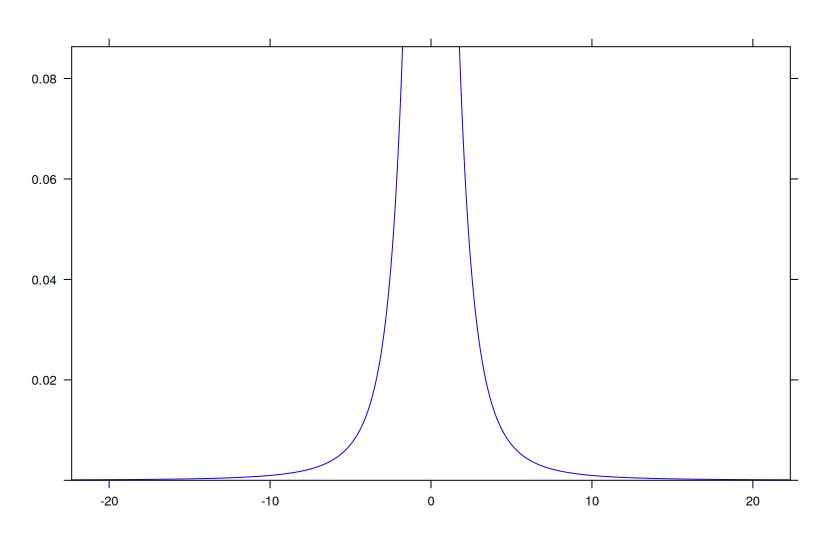
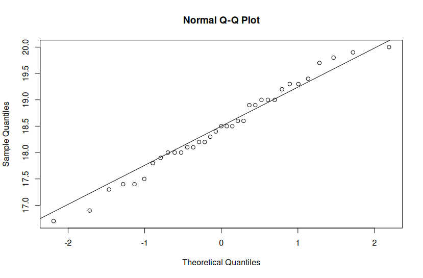
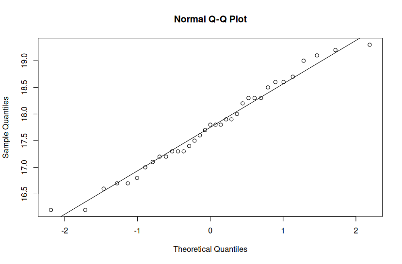
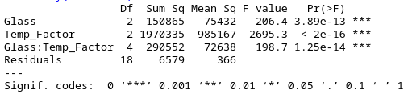

# Modul2_Probstat_5025211213

Repository ini berisi kode dan output dari praktikum 1 mata kuliah Probabilistik
dan Statistika milik:

- Nama  : Richie Seputro
- NRP   : 5025211213
- Kelas : Probabilistik dan Statistika A

## Penjelasan Jawaban

### Nomor 1

Seorang peneliti melakukan penelitian mengenai pengaruh aktivitas 𝐴 terhadap
kadar saturasi oksigen pada manusia. Peneliti tersebut mengambil sampel sebanyak
9 responden. Pertama, sebelum melakukan aktivitas 𝐴, peneliti mencatat kadar
saturasi oksigen dari 9 responden tersebut. Kemudian, 9 responden tersebut
diminta melakukan aktivitas 𝐴. Setelah 15 menit, peneliti tersebut mencatat
kembali kadar saturasi oksigen dari 9 responden tersebut. Berikut data dari 9
responden mengenai kadar saturasi oksigen sebelum dan sesudah melakukan
aktivitas 𝐴.

| Responden   | X | Y |
|-------------|---|---|
| 1 | 78 | 100 |
| 2 | 75 | 95 |
| 3 | 67 | 70 |
| 4 | 77 | 90 |
| 5 | 70 | 90 |
| 6 | 72 | 90 |
| 7 | 78 | 89 |
| 8 | 74 | 90 |
| 9 | 77 | 100 |

Berdasarkan data pada tabel diatas, diketahui kadar saturasi oksigen dari
responden ke-3 ketika belum melakukan aktivitas 𝐴 sebanyak 67, dan setelah
melakukan aktivitas 𝐴 sebanyak 70.

#### (a)

> Carilah standar deviasi dari data selisih pasangan pengamatan tabel di atas.

**Pertama**, masukkan data ke dalam column agar mudah diolah.

```R
respondent <- c(1, 2, 3, 4, 5, 6, 7, 8, 9)
x <- c(78, 75, 67, 77, 70, 72, 78, 74, 77)
y <- c(100, 95, 70, 90, 90, 90, 89, 90, 100)
```

**Kedua**, masukkan data-data ke dalam dataframe dan tampilkan dataframe-nya.

```R
df <- data.frame(respondent, x, y)
df
```


**Ketiga**, hitung selisih antara data-sebelum dan data-sesudah dan tampilkan.

```R
difference <- abs(df[,3] - df[,2])
difference
```


**Keempat**, hitung simpangan bakunya.

```R
stddev <- sd(difference)
stddev
```


#### (b)

> Carilah nilai t (p-value).

Gunakan method `t.test()` dengan parameter berikut untuk mencari nilai t (p-value).

```R
t.test(y, x, paired = TRUE)
```


#### (c)

> Tentukanlah apakah terdapat pengaruh yang signifikan secara statistika dalam
hal kadar saturasi oksigen, sebelum dan sesudah melakukan aktivitas 𝐴 jika
diketahui tingkat signifikansi 𝛼 = 5% serta H0 : “tidak ada pengaruh yang
signifikan secara statistika dalam hal kadar saturasi oksigen, sebelum dan
sesudah melakukan aktivitas 𝐴”

Dikarenakan nilai t (p-value) adalah 6.003e-05 atau 0.00006003 yang lebih kecil
dibandingkan dengan tingkat signifikansi 𝛼 = 0.05, maka
**hipotesis null (H0) ditolak dan hipotesis alternatif (H1) diterima.** 

Maka, disimpulkan bahwa ada pengaruh yang signifikan secara statistika dalam
hal kadar saturasi oksigen, sebelum dan sesudah melakukan aktivitas 𝐴 pada
tingkat signifikansi 5%.

### Nomor 2

Diketahui bahwa mobil dikemudikan rata-rata lebih dari 20.000 kilometer per
tahun. Untuk menguji klaim ini, 100 pemilik mobil yang dipilih secara acak
diminta untuk mencatat jarak yang mereka tempuh. Jika sampel acak menunjukkan
rata-rata 23.500 kilometer dan standar deviasi 3900 kilometer.
(Kerjakan menggunakan 2 library seperti referensi pada modul).

#### (a)

> Apakah Anda setuju dengan klaim tersebut?

Setuju, klaim tersebut sangatlah mungkin. Rata-rata sampel 23.500 km dengan
simpangan baku 3.900 km membuat distribusi data lebih ke daerah yang lebih besar
dari 20.000 km (hitungan kasar: 23.500 - 3.900 <= mean <= 23.500 + 3.900).

Selanjutnya, gunakan library BSDA sesuai modul.

```R
install.packages("BSDA")
library(BSDA)
```

#### (b)

> Jelaskan maksud dari output yang dihasilkan!

Method yang digunakan adalah method `tsum.test()` dengan parameter-parameter
sebagai berikut, hasil juga dilampirkan di bawahnya:

```R
tsum.test(mean.x = 23500, s.x = 3900, n.x = 100)
```


Hal tersebut berarti dengan interval kepercayaan 95%, rata-rata jarak tempuh
mobil per tahun berada di antara 22.726,16 km dan 24.273,84 km. 

Dengan interval kepercayaan 95% dan dari 100 responden dan nilai p-value yang
kurang dari tingkat signifikansi 𝛼 = 0.05 maka,
**hipotesis null (H0) diterima**.

#### (c)

> Buatlah kesimpulan berdasarkan P-Value yang dihasilkan!

Seperti yang telah dibahas pada poin sebelumnya (b), maka dapat disimpulkan
bahwa klaim mobil dikemudikan rata-rata lebih dari 20.000 kilometer per
tahun terbukti benar.

### Nomor 3

Diketahui perusahaan memiliki seorang data analyst ingin memecahkan permasalahan
pengambilan keputusan dalam perusahaan tersebut. Selanjutnya didapatkanlah data
berikut dari perusahaan saham tersebut.

| Nama Kota/Atribut   | Bandung | Bali |
|---------------------|---------|------|
| Jumlah Saham              | 19 | 27 |
| Sampel Mean               | 3.64 | 2.79 |
| Sampel Standar Deviasi    | 1.67 | 1.32 |

Dari data diatas berilah keputusan serta kesimpulan yang didapatkan dari hasil
diatas. Asumsikan nilai variancenya sama, apakah ada perbedaan pada
rata-ratanya (α= 0.05)? Buatlah:

#### (a)

> H0 dan H1

Berikut adalah H0 dan H1 yang dibuat berdasarkan deskripsi soal:

- H0 : μ1 = μ2 (rata-rata saham di Bandung sama dengan di Bali)
- H1 : μ1 ≠ μ2 (rata-rata saham di Bandung tidak sama dengan di Bali)

#### (b)

> Hitung sampel statistik

Method yang digunakan adalah `tsum.test()` dengan parameter sesuai dengan data
pada tabel terlampir.

```R
tsum.test(mean.x = 3.64, s.x = 1.67, n.x = 19, 
          mean.y = 2.79, s.y = 1.32, n.y = 27, 
          alternative = "greater", var.equal = TRUE)
```


#### (c)

> Lakukan uji statistik (df = 2)

Install package `mosaic` dan *load* ke environment.

```R
install.packages("mosaic")
library(mosaic)
```

Gunakan fungsi `plotDist()` untuk memvisualisasikan statistik dengan derajat
bebas (degree of freedom) 2.

```R
plotDist(dist = 't', df = 2, col = "blue")
```



#### (d)

> Nilai Kritikal

Gunakan fungsi `qchisq()` dengan nilai `df` yang diberikan.

```R
qchisq(p = 0.05, df = 2, lower.tail = FALSE)
```


#### (e)

> Keputusan

Keputusan dapat diperoleh dengan fungsi `t.test`. Karena nilai
t-test < t-kritikal, maka tidak ada bukti yang cukup untuk menolak hipotesa null
(H0).

#### (f)

> Kesimpulan

Kesimpulan yang didapatkan yaitu perbedaan rata-rata yang terjadi tidak ada
jika dilihat dari uji statistik. Namun, perbedaan akan ada (kecil nilainya),
dipengaruhi oleh nilai kritikal.

### Nomor 4

Seorang Peneliti sedang meneliti spesies dari kucing di ITS. Dalam penelitiannya
ia mengumpulkan data tiga spesies kucing yaitu kucing oren, kucing hitam dan
kucing putih dengan panjangnya masing-masing.

Jika diketahui dataset pada **https://intip.in/datasetprobstat1** dan H0 adalah
tidak ada perbedaan panjang antara ketiga spesies atau rata-rata panjangnya sama,
maka kerjakan atau carilah:

#### (a)

> Buatlah masing masing jenis spesies menjadi 3 subjek "Grup" (grup 1, grup 2,
dan grup 3). Lalu gambarkan plot kuantil normal untuk setiap kelompok dan lihat
apakah ada outlier utama dalam homogenitas varians.

**Pertama**, masukkan data dari dataset yang disediakan.

```R
anovaData <- read.table("onewayanova.txt", header = TRUE)
attach(anovaData)
names(anovaData)
```

**Kedua**, lakukan grouping sesuai dengan label yang telah ditentukan sekaligus
melakukan pengecekan value dalam grup yang dihasilkan.

```R
anovaData$Group <- as.factor(anovaData$Group)
anovaData$Group <- factor(anovaData$Group,
                          labels = c("Kucing Oren", "Kucing Hitam", "Kucing Putih"))
```

**Ketiga**, bagi tiap nilai menjadi 3 bagian sesuai dengan label grup yang
telah dibuat.

```R
groupKO <- subset(anovaData, Group == "Kucing Oren")
groupKH <- subset(anovaData, Group == "Kucing Hitam")
groupKP <- subset(anovaData, Group == "Kucing Putih")
```

**Keempat**, gambar plot kuantil normal untuk setiap grup untuk melihat
distribusi data dan outlier / pencilan utama dalam homogenitas varians pada
masing-masing grup.

```R
qqnorm(groupKO$Length)
qqline(groupKO$Length)
```



```R
qqnorm(groupKH$Length)
qqline(groupKH$Length)
```



```R
qqnorm(groupKP$Length)
qqline(groupKP$Length)
```


#### (b)

> Carilah atau periksalah homogeneity of variances-nya. Berapa nilai p yang
didapatkan? Apa hipotesis dan kesimpulan yang dapat diambil?

Gunakan method `bartlett.test()` dengan parameter yang bersumber dari data.

```R
bartlett.test(Length ~ Group, data = anovaData)
```


Method `bartlett.test()` mengeluarkan p-value sebesar 0.8054 yang lebih dari
nilai signifikansi 𝛼 = 0.05 sehingga asumsi kesamaan varians terpenuhi.

#### (c)

> Untuk uji ANOVA (satu arah), buatlah model linier dengan panjang versus grup
dan beri nama model tersebut model 1.

Gunakan method `lm()` untuk membuat linear model dan `anova()` untuk uji ANOVA.

```R
model1 <- lm(Length ~ Group, data = anovaData)
anova(model1)
```


#### (d)

> Dari hasil poin C, berapakah nilai p? Apa yang dapat Anda simpulkan dari H0?

p-value yang didapatkan sebesar 0.0013. Maka, dapat disimpulkan bahwa terdapat
perbedaan panjang kucing yang signifikan berdasarkan grupnya.

#### (e)

> Verifikasilah jawaban model 1 dengan Post-hoc test Tukey HSD, dari nilai p
yang didapatkan apakah satu jenis kucing lebih panjang dari yang lain? Jelaskan.

Gunakan fungsi `TukeyHSD()` dengan parameter luaran dari fungsi `aov()` yang
menerima model 1.

```R
TukeyHSD(aov(model1))
```


Terlihat dari hasil uji Tukey bahwa grup yang paling menunjukkan perbedaan
signifikan adalah **grup kucing hitam-kucing oren** dan
**grup kucing hitam-kucing putih** dengan 𝛼 = 5%.

#### (f)

> Visualisasikan data dengan ggplot2

Gunakan fungsi `ggplot()` untuk melakukan visualisasi data.

```R
install.packages("ggplot2")
library("ggplot2")

ggplot(dataoneway, aes(x = Group, y = Length)) +
  geom_boxplot(fill = "grey70", colour = "black") +
  scale_x_discrete() +
  xlab("Treatment Group") +
  ylab("Length (cm)")
```


### Nomor 5

Data yang digunakan merupakan hasil eksperimen yang dilakukan untuk mengetahui
pengaruh suhu operasi (100˚C, 125˚C, dan 150˚C) dan tiga jenis kaca pelat muka
(A, B dan C) pada keluaran cahaya tabung osiloskop. Percobaan dilakukan sebanyak
27 kali dan didapatkan
[**data hasil eksperimen berikut**](https://drive.google.com/file/d/1aLUOdw_LVJq6VQrQEkuQhZ8FW43FemTJ/view).
Dengan data tersebut:

#### (a)

> Buatlah plot sederhana untuk visualisasi data

**Pertama**, gunakan beberapa library sebagai berikut.

```R
install.packages("multcompView")
library(readr)
library(multcompView)
library(dplyr)
```

**Kedua**, masukkan dataset yang telah disediakan.

```R
gtl <- read.csv("GTL.csv")
```

**Ketiga**, lakukan visualisasi pada dataset dengan fungsi `qplot()`.

```R
qplot(x = Temp, y = Light, geom = "point", data = gtl) +
  facet_grid(.~Glass, labeller = label_both)
```


#### (b)

> Lakukan uji ANOVA dua arah

**Pertama**, buat variabel as-factor sebagai ANOVA.

```R
gtl$Glass <- as.factor(gtl$Glass)
gtl$Temp_Factor <- as.factor(gtl$Temp)
```

**Kedua**, lakukan analisis of variance (AoV) dengan fungsi `summary(aov())`
sebagai berikut.

```R
anovaData <- aov(Light ~ Glass*Temp_Factor, data = gtl)
summary(anovaData)
```



#### (c)

> Tampilkan tabel dengan mean dan standar deviasi keluaran cahaya untuk setiap
perlakuan (kombinasi kaca pelat muka dan suhu operasi)

Gunakan fungsi `group_by()` yang selanjutnya digunakan
untuk melakukan data summary dengan fungsi `summarise()` sesuai mean dan standar
deviasi.

```R
summarizedData <- group_by(gtl, Glass, Temp) %>%
  summarise(mean = mean(Light), sd = sd(Light)) %>%
  arrange(desc(mean))

print(summarizedData)

```


#### (d)

> Lakukan uji Tukey

Pengujian Tukey menggunakan fungsi `TukeyHSD()` sebagai berikut.

```R
tukey <- TukeyHSD(anovaData)
print(tukey)
```


#### (e)

> Gunakan compact letter display untuk menunjukkan perbedaan signifikan antara
uji Anova dan uji Tukey

**Pertama**, buat compact letter display dengan fungsi `multcompLetterS4()`
sebagai berikut.

```R
tukey.cld <- multcompLetters4(anovaData, tukey)
print(tukey.cld)
```


**Kedua**, tambahkan compact letter display tersebut ke tabel dengan mean dan
standar deviasi yang telah dibuat sebelumnya.

```R
cld <- as.data.frame.list(tukey.cld$`Glass:Temp_Factor`)
summarizedData$Tukey <- cld$Letters
print(summarizedData)
```

